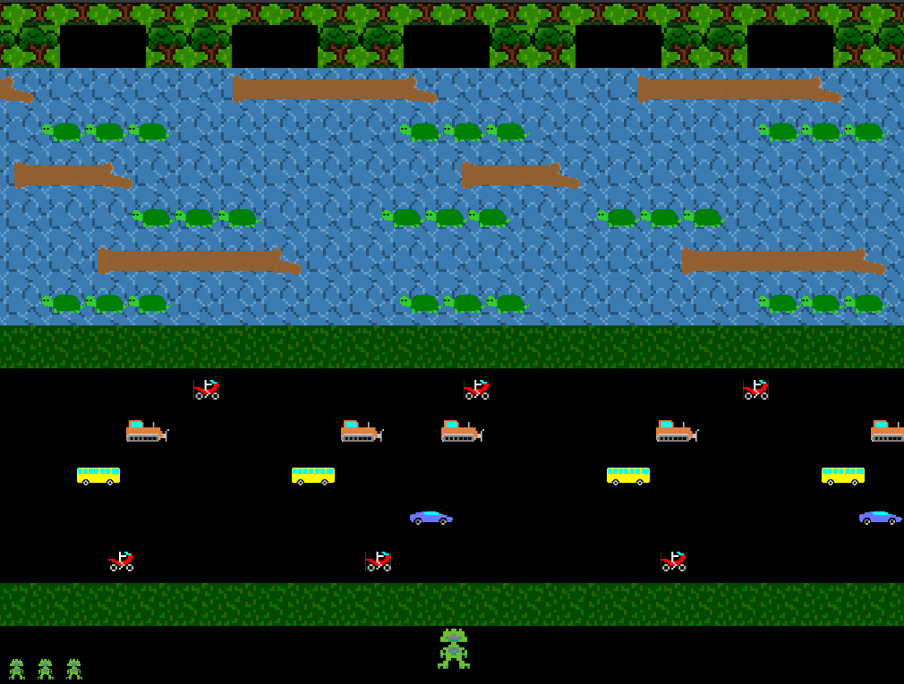

# Frogger

This application was an assignment for the second year subject **Object Oriented Software Development**. 
It is a simple version of the popular Frogger game, written in Java. 

The below instructions are to run the game using the Eclipse IDE however they are adaptable to any IDE.

1. Create an Eclipse project. We’re going to set up the Slick library for game development, which uses LWJGL (Light-Weight Java Gaming Library) for its graphics and input.

2. Create a new directory named **lib** in your project. 

3. Extract the **Slick.zip** archive. Select all of the .jar files, and .dll files (Windows), .dylib files (OSX), or .so files (Linux) and move them to the **lib**.

4. Right click each of the .jar files in the Project Explorer and select “Build Path → Add to build path”. You should see a new icon appear in the Project Explorer called **Referenced Libraries**.

5. Right click **lwjgl.jar** from the **Referenced Libraries** directory of your project. Press “Properties → Native Library → External Folder”. Add your project's **lib** directory as the path.

6. Move the **src** and **assets** directories from the repository into the Eclipse project.

7. Enjoy!

Please do not hesitate to contact me if you have any issues or further queries.

